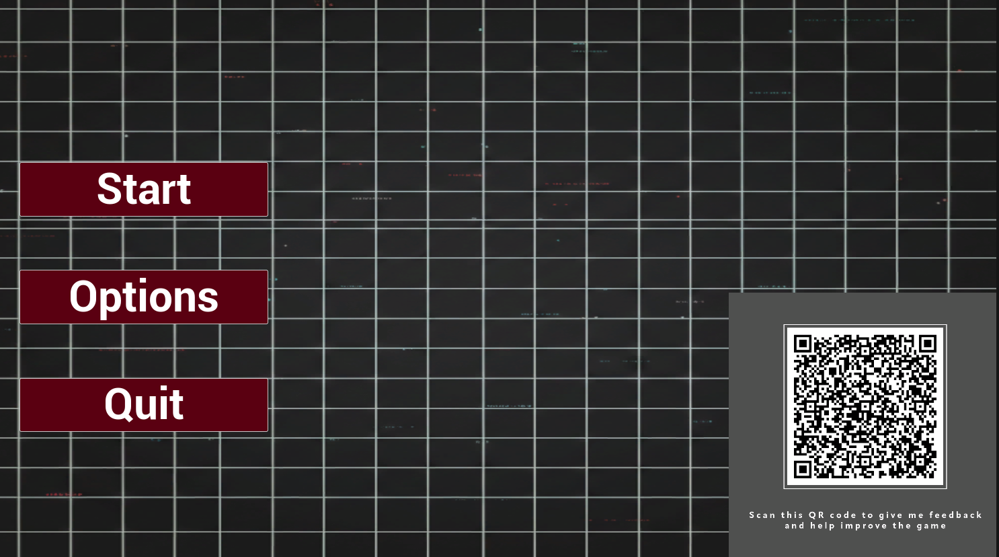

# Commentary 
## Player Feedback Collection and Consent

I collect player feedback for my Final Major Project Prototype using an external Google Forms survey. Access to the survey was provided through a QR code displayed prominently in the game’s main menu, allowing players to easily submit feedback after completing a play session without interrupting gameplay. This method ensured accessibility while keeping feedback collection separate from the game’s core systems.

The survey was divided into three structured sections. The first section focused on ethical considerations and test context. Players were asked to provide informed consent to participate in the playtest and to allow their responses to be used for academic purposes. If consent was not given, the survey automatically redirected the participant to an opt-out message, ensuring that no data was collected without permission. This section also recorded the version of the game tested and the platform used, enabling feedback to be accurately contextualised against specific builds and hardware setups.

The second section collected quantitative feedback using 1–5 rating scales. Players were asked to rate the overall scare factor, game difficulty, environmental design, and technical quality. These metrics were chosen to directly reflect the core design goals of a first-person horror game, particularly atmosphere, challenge balance, visual storytelling, and perceived performance stability. Using numerical ratings made it possible to compare responses across multiple testers and identify overall trends.

The third section gathered qualitative feedback through long-form text responses. Players were invited to describe any bugs or technical issues encountered during gameplay and to suggest potential improvements. This open-ended format allowed testers to provide detailed explanations and highlight issues that may not be captured by numerical ratings alone, such as unclear mechanics, pacing problems, or immersion-breaking moments.

## Tools and Services Used

Google Forms was used to design and distribute the player feedback survey. This tool was selected due to its ease of use, built-in consent handling, and automatic aggregation of responses into a structured format suitable for analysis. Survey results could be reviewed in real time and exported for further evaluation if required. QR codes linking to the survey were generated externally and embedded into the game’s main menu UI using Unreal Engine 5’s widget system.

No in-engine telemetry or automated performance logging was implemented for this prototype. Instead, the focus of testing was placed on player-reported experience and perceived technical quality, as communicated through survey responses.

## Informing QA and Game Improvements

The collected survey data provides valuable insight for quality assurance and future development. Quantitative ratings help identify strengths and weaknesses in areas such as scare effectiveness, difficulty balancing, and environmental design. Qualitative responses offer actionable feedback on bugs, usability issues, and player expectations.

This feedback can be used to prioritise bug fixing, refine level design, adjust difficulty curves, and improve overall presentation and polish. By combining structured ratings with detailed written comments, the testing process supports informed iteration and helps guide improvements for subsequent versions of the game.

 

### QR Code

QR code is visible in main menu. I have made it large so players won't miss it, however the menu layout will be redesigned after the prototype phase. 

### Survey and Responses

